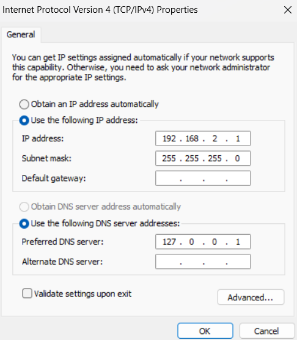

# PYNQ-Z2

## Installing the software

Two main steps need to be taken to in terms of installing software for the PYNQ Z2:

1. Install PYNQ Z2 sofware on its SD Card.
   1. Download the software for the PYNQ Z2 from [here](https://github.com/Xilinx/PYNQ/releases).
      - (At the time of writing the newest version was: `PYNQ-Z2 v3.0.0 SDCard image`).
   1. Unzip it!
   1. Insert the SD Card into your pc.
   1. Using your favourite disk imager (mine is [Rufus](https://rufus.ie/en/)), flash the .img to the SD Card.
   1. Once it is done, insert the SD card into the PYNQ Z2.
2. Install Vivado on your computer.
    1. For Windows, download from [here](https://www.xilinx.com/support/download/index.html/content/xilinx/en/downloadNav/vivado-design-tools.html), Linux is available elsewhere, MacOS is unavailable.
        - Unfortunately you will have to make an account (you can put Hanze's information).
    2. Launch the downloaded executable, download Vivado ML Standard (you can prevent it from installing unnessecary stuff, that can save a lot of time. The downloader asks you to disable your antivirus software, we do not recommend this).
    3. After download, make sure to also install Vivado (it require 55GB of free space).

## Getting started

To really get going start with connecting to your PYNQ Z2 via the browser:
1. Connect your laptop to the PYNQ Z2 Jupyter Notebook environment.
      - At school we can**not** use school's connection and therefore need a direct ethernet connection to your pc.
          1. Connect an ethernet cable between your PC and PYNQ Z2.
          1. Power your board using the power adapter.
          1. On your Windows 11 machine, navigate: `settings > network & internet > advanced network settings > unidentified network > edit more adapter options > select IPv4 > Properties`, copy these settings: 
          Press OK, then Close.
          1. Open this in the browser: http://192.168.2.99:9090/
              - Be patient. If it does not work, reboot your PYNQ Z2. Then be _very_ patient, the PYNQ Z2 is booted when the LEDs blink for a few times.
          1. The default password is `xilinx`.
      - At home you can probably hook up your PYNQ Z2 to your router.
          - The benefit to this is that the PYNQ Z2 will then also have internet access.
          - Find the IP address of your PYNQ Z2 through your router's admin panel (or by scanning your local network).
2. In the Jupyter Notebooks environment you can find some example files. Feel invited to look at those, but do not spend too much time on them, they are of limited use.

## Base example

1. Make a new notebook.
1. Put this code in a notebook:
```python
from pynq.overlays.base import BaseOverlay
base = BaseOverlay("base.bit")

help(base)
```
3. Try to turn on/off the LEDs, and read out the switches. You can use `help()` and/or `dir()`.
    - Or, for more information [see the docs](https://pynq.readthedocs.io/en/v2.6.1/pynq_overlays/loading_an_overlay.html).

## Adder example

As a simple example of the FPGA hardware acceleration, we can use the adder example ([original source](https://www.youtube.com/watch?v=2ErFDGSv5EE) but it is a bit outdated)  found in this repository:
1. Clone this repository to your PC.
1. Get the file to your PYNQ Z2, you can do this using the upload button in the Jupyter Notebooks user interface.
1. From within a Jupyter Notebooks, in Python find `adder.bit` file and load it into the FPGA (this file was generated using 
```python
from pynq import Overlay
overlay = BaseOverlay("adder.bit")

help(overlay)
```
4. From within Jupyter Notebooks, interact with the FPGA to make it do addition. Can you make it do addition? The write addresses are `0x10`, `0x18`, the read address is `0x20`.

```python
overlay.write(0x10, 3)
overlay.write(0x18, 6)
overlay.read(0x20)
```

##  FIR Filter

This is an interesting tutorial to follow: https://www.fpgadeveloper.com/2018/03/how-to-accelerate-a-python-function-with-pynq.html/

However, note that at the end, the you are interested in a .hwh file (not .tcl) and a .bit.

## Community Projects

We can also use the power of the community, like [here](https://www.pynq.io/community.html) or [here](https://www.pynq.io/embedded.html). 
- Note, since [version 2.6 .tcl files are deprecated](https://pynq.readthedocs.io/en/latest/changelog.html#:~:text=Tcl%20parsing%20removed%20%2D%20please%20generate%20and%20use%20an%20HWH%20file%20for%20Overlays). This means that only `*.hwh` files are currently supported. Ignore any (online) project that do not provide `*.hwh` files, `*.bit` files are also still necessary.

`More information about community projects TBA`